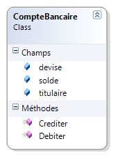
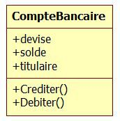
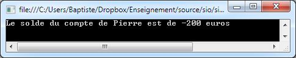
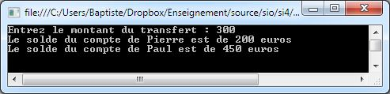

# Initiation à la programmation orientée objet

L'objectif de ce chapitre est de découvrir ce qu'est la programmation orientée objet.

## Introduction

### Pourquoi utiliser la programmation orientée objet ?

La programmation de logiciels a connu il y a quelques années le passage d'une ère artisanale à une ère industrielle. Des logiciels de plus en plus complexes doivent être réalisés dans des délais de plus en plus courts, tout en maintenant le meilleur niveau de qualité possible. Comment faire pour répondre à ces exigences contradictoires ? La solution passe par l'emploi de techniques de développement adaptées, comme l'illustre l'extrait ci-dessous.

> (...) Il est clair que le monde du logiciel ne progresse pas aussi vite que celui du matériel. Qu'ont donc les développeurs de matériel que les développeurs de logiciels n'ont pas ? La réponse est donnée par les composants. Si les ingénieurs en matériel électronique devaient partir d'un tas de sable à chaque fois qu'ils conçoivent un nouveau dispositif, si leur première étape devait toujours consister à extraire le silicium pour fabriquer des circuits intégrés, ils ne progresseraient pas bien vite. Or, un concepteur de matériel construit toujours un système à partir de composants préparés, chacun chargé d'une fonction particulière et fournissant un ensemble de services à travers des interfaces définies. La tâche des concepteurs de matériel est considérablement simplifiée par le travail de leurs prédécesseurs.

> La réutilisation est aussi une voie vers la création de meilleurs logiciels. Aujourd'hui encore, les développeurs de logiciels en sont toujours à partir d'une certaine forme de sable et à suivre les mêmes étapes que les centaines de programmeurs qui les ont précédés. Le résultat est souvent excellent, mais il pourrait être amélioré. La création de nouvelles applications à partir de composants existants, déjà testés, a toutes chances de produire un code plus fiable. De plus, elle peut se révéler nettement plus rapide et plus économique, ce qui n'est pas moins important. (...)"

David Chappel, "Au coeur de ActiveX et OLE", 1997

La programmation orientée objet, souvent abrégée **POO**, permet de concevoir une application sous la forme d'un ensemble de briques logicielles appelées des **objets**. Chaque objet joue un rôle précis et peut communiquer avec les autres objets. Les interactions entre les différents objets vont permettre à l'application de réaliser les fonctionnalités attendues.

La POO facilite la conception de programmes par réutilisation de composants existants, avec tous les avantages évoqués plus haut. Elle constitue le standard actuel (on parle de *paradigme*) en matière de développement de logiciels.

### Histoire de la programmation orientée objet

Les concepts de la POO naissent au cours des années 1970 dans des laboratoires de recherche en informatique. Les premiers langages de programmation véritablement objets ont été **Simula**, puis **Smalltalk**.

A partir des années 1980, les principes de la POO sont appliqués dans de nombreux langages comme **Eiffel** (créé par le Français Bertrand Meyer), **C++** (une extension objet du langage **C** créé par le Danois Bjarne Stroustrup) ou encore **Objective C** (une autre extension objet du C utilisé, entre autres, par l'iOS d'Apple).

Les années 1990 ont vu l'avènement des langages orientés objet dans de nombreux secteurs du développement logiciel, et la création du langage **Java** par la société Sun Microsystems. Le succès de ce langage, plus simple à utiliser que ses prédécesseurs, a conduit Microsoft à riposter en créant au début des années 2000 la plate-forme **.NET** et le langage **C#**, cousin de Java.

De nos jours, de très nombreux langages permettent d'utiliser les principes de la POO dans des domaines variés : Java et C# bien sûr, mais aussi **PHP** (à partir de la version 5), **VB.NET**, **PowerShell**, **Python**, etc. Une connaissance minimale des principes de la POO est donc indispensable à tout informaticien, qu'il soit développeur ou non.

**REMARQUE** : la POO s'accompagne d'un changement dans la manière de penser les problèmes et de concevoir l'architecture des applications informatiques. C'est ce qu l'on appelle l'analyse (ou la modélisation) orientée objet. Son principal support est le langage de modélisation **UML**.

## Première approche de la POO

### La notion d'objet

Quand on utilise la POO, on cherche à représenter le domaine étudié sous la forme d'objets. C'est la phase de **modélisation orientée objet**.

Un **objet** est une entité qui représente (*modélise*) un élément du domaine étudié : une voiture, un compte bancaire, un nombre complexe, une facture, etc.

### Objet = état + actions

Cette équation signifie qu'un objet rassemble à la fois :

* des **informations** (ou données) qui le caractérisent.
* des **actions** (ou traitements) qu'on peut exercer sur lui.

Imaginons qu'on souhaite modéliser des comptes bancaires pour un logiciel de gestion. On commence par réfléchir à ce qui caractérise un compte bancaire, puis on classe ces éléments en deux catégories :

* les informations liées à un compte bancaire.
* les actions réalisables sur un compte bancaire.

En première approche, on peut considérer qu'un compte bancaire est caractérisé par un **titulaire**, un **solde** (le montant disponible sur le compte) et utilise une certaine **devise** (euros, dollars, etc). Les actions réalisables sur un compte sont le dépôt d'argent (**crédit**) et le retrait (**débit**).

On peut regrouper les caractéristiques de notre objet "compte bancaire" dans ce tableau.

Informations | Actions
-------------|--------
titulaire, solde, devise | créditer, débiter

**DEFINITION** : un **objet** se compose **d'informations** et **d'actions**. Les actions utilisent (et parfois modifient) les informations de l'objet.

* L'ensemble des informations d'un objet donné est appelée son **état**.
* L'ensemble des actions applicables à un objet représente son **comportement**.

**REMARQUE** : les actions associées à un objet s'expriment généralement sous la forme de verbes à l'infinitif (*créditer*, *débiter*).

A un instant donné, l'état d'un objet "compte bancaire" sera constitué par les valeurs de son titulaire, son solde et sa devise. L'état de l'objet "compte bancaire de Paul" sera, sauf exception, différent de l'état de l'objet "compte bancaire de Pierre".

### La notion de classe

Nous venons de voir que l'on pouvait représenter un compte bancaire sous la forme d'un objet. Imaginons que nous voulions gérer les différents comptes d'une banque. Chaque compte aura son propre titulaire, son solde particulier et sa devise. Mais tous les comptes auront un titulaire, un solde et une devise, et permettront d'effectuer les mêmes opérations de débit/crédit. Chaque objet "compte bancaire" sera construit sur le même modèle : ce modèle est appelée une **classe**.

**DEFINITION** : une **classe** est un **modèle d'objet**. C'est un nouveau type créé par le programmeur et qui sert de modèle pour tous les objets de cette classe. Une classe spécifie les informations et les actions qu'auront en commun tous les objets qui en sont issus.

Le compte en banque appartenant à Jean, dont le solde est de 450 euros, est un compte bancaire particulier. Il s'agit d'un objet de la classe "compte bancaire". En utilisant le vocabulaire de la POO, on dit que l'objet "compte bancaire de Jean" est une **instance** de la classe "compte bancaire".

**ATTENTION** : ne pas confondre **objet** et **classe**. Une classe est un type abstrait (exemple : un compte bancaire en général), un objet est un exemplaire concret d'une classe (exemple : le compte bancaire de Jean).

Un objet est une variable particulière dont le type est une classe.

### Représentation graphique

Afin de faciliter la communication entre les programmeurs utilisant des langages orientés objet différents, il existe un standard de représentation graphique d'une classe. Ce standard fait partie de la norme UML (*Unified Modeling Language*). On parle de **diagramme de classe**.

Voici la représentation de notre classe "compte bancaire" réalisée par Visual Studio.



Voici la même classe représentée sous la forme d'un diagramme conforme au standard UML.



Quel que soit l'outil utilisé, on observe que la classe est décomposée en deux parties :

* les **champs**, qui correspondent aux informations de la classe : *devise*, *solde* et *titulaire*.
* les **méthodes**, qui correspondent aux actions réalisables: *créditer*, *débiter* et *décrire*.

**DEFINITION** : une **méthode** représente une action réalisable sur un objet de la classe dans laquelle cette méthode est définie. Une méthode représente une partie du comportement d'une classe.

### En résumé

* La POO consiste à programmer en utilisant des **objets**.
* Un objet modélise un élément du domaine étudié (exemples : un compte bancaire, une voiture, un satellite, etc).
* Un objet est une **instance** de **classe**. Une classe est un type abstrait, un objet est un exemplaire concret de cette classe.
* Une classe regroupe des **informations** et des **actions**.
* Les informations sont stockées sous la forme de **champs**. Les champs décrivent l'**état** d'un objet.
* Les actions réalisables sur un objet sont représentés par des **méthodes**. Elles expriment ce que les objets peuvent faire, leur **comportement**.

Les informations stockées par un objet peuvent être appelées **champs**, **attributs** ou encore **propriétés**. Attention, ce dernier terme est ambigu en C# (voir plus loin).

## Programmer avec des objets

### Ecriture d'une classe

Une fois la modélisation d'une classe terminée, il est possible de la traduire dans n'importe quel langage de programmation orienté objet.

Voici la traduction en C# de la classe `CompteBancaire`.

```csharp
public class CompteBancaire
{
    public string titulaire;
    public double solde;
    public string devise;

    public void Crediter(double montant)
    {
        solde = solde + montant;
    }
    public void Debiter(double montant)
    {
        solde = solde - montant;
    }
}
```

La définition d'une classe commence par le mot-clé `class`. On retrouve ensuite la définition des champs (attributs) et des méthodes de la classe. On remarque que les méthodes utilisent (et modifient) les valeurs des attributs.

Une méthode est une sorte de mini-programme. On peut y déclarer des variables locales et y utiliser tous les éléments de programmation déjà connus (alternatives, boucles, etc).

On remarque un nouveau mot-clé : `public`, sur lequel nous reviendrons ultérieurement.

### Utilisation d'une classe

En utilisant le modèle fourni par la classe, il est possible de créer autant d'objets que nécessaire. Différents objets  d'une même classe disposent des mêmes attributs et des m^émes méthodes, mais les valeurs des attributs sont différentes pour chaque objet. Par exemple, tous les comptes bancaires auront un solde, mais sauf exception, ce solde sera différent pour chaque compte.

Le programme C# ci-dessous utilise la classe `CompteBancaire` définie plus haut pour créer le compte de Jean et y effectuer deux opérations.

```csharp
static void Main(string[] args)
{
    CompteBancaire comptePierre;          // déclaration d'un nouvel objet
    comptePierre = new CompteBancaire();  // instanciation de cet objet

    // affectations de valeurs aux attributs
    comptePierre.titulaire = "Pierre";
    comptePierre.solde = 0;
    comptePierre.devise = "euros";

    // appels des méthodes
    comptePierre.Crediter(300);
    comptePierre.Debiter(500);

    string description = "Le solde du compte de " + comptePierre.titulaire +
        " est de " + comptePierre.solde + " " + comptePierre.devise;
    Console.WriteLine(description);
}
```

A la fin du programme, l'attribut *solde* de l'objet `comptePierre` contient la valeur -200.



### Déclaration et instanciation

On remarque que la création de l'objet `comptePierre` se fait en deux étapes :

1.  déclaration de l'objet
2.  instanciation de l'objet

```csharp
CompteBancaire comptePierre;          // déclaration d'un nouvel objet
comptePierre = new CompteBancaire();  // instanciation de cet objet
// ...
```

La **déclaration** permet de créer une nouvelle variable, appelée `comptePierre` dans l'exemple ci-dessus. A ce stade, aucune réservation de mémoire n'a eu lieu pour cet objet. Il est donc inutilisable.

Le type de la variable `comptePierre` est `CompteBancaire`. Le type d'un objet est sa classe.

**L'instanciation** utilise l'opérateur `new`, qui permet de réserver une zone mémoire spécifique pour l'objet. On dit que l'objet est instancié par l'opérateur `new`. Sans cette étape indispensable, l'objet déclaré ne peut pas être utilisé.

**DEFINITION** : **l'instanciation** est l'opération qui consiste à créer un nouvel objet à partir d'une classe, au moyen de l'opérateur `new`.

Il est courant de rassembler sur une même ligne déclaration et instanciation d'un objet.

```csharp
CompteBancaire comptePierre = new CompteBancaire();  // déclaration et instanciation d'un nouvel objet
// ...
```

**ATTENTION** : ne pas confondre **instanciation** et **initialisation** :

* instancier, c'est créer un nouvel objet (opérateur ``new``)
* initialiser, c'est donner une valeur initiale à quelque chose (opérateur ``=``)

### Ajout d'une méthode

Comme il est fastidieux de construire la description d'un compte bancaire à chaque fois qu'on en a besoin, on voudrait ajouter une opération de description du compte. Cette action est réalisée par une nouvelle méthode nommée *Decrire* ajoutée à la classe `CompteBancaire`. La description est renvoyée sous la forme d'une chaîne de caractères (`string`).

```csharp
public class CompteBancaire
{
    // ...

    // Renvoie la description d'un compte
    public string Decrire()
    {
        string description = "Le solde du compte de " +  titulaire + " est de " + solde + " " + devise;
        return description;
    }
}
```

### Instanciation de plusieurs objets

Voici un autre programme qui gère les comptes de Pierre et de Paul. Il permet à l'utilisateur de saisir un montant qui sera débité à Pierre et crédité à Paul.

```csharp
static void Main(string[] args)
{
    CompteBancaire comptePierre = new CompteBancaire();
    comptePierre.titulaire = "Pierre";
    comptePierre.solde = 500;
    comptePierre.devise = "euros";

    CompteBancaire comptePaul = new CompteBancaire();
    comptePaul.titulaire = "Paul";
    comptePaul.solde = 150;
    comptePaul.devise = "euros";

    Console.Write("Entrez le montant du transfert : ");
    double montantTransfert = Convert.ToDouble(Console.ReadLine());
    comptePierre.Debiter(montantTransfert);
    comptePaul.Crediter(montantTransfert);

    Console.WriteLine(comptePierre.Decrire());
    Console.WriteLine(comptePaul.Decrire());
}
```


