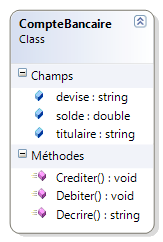
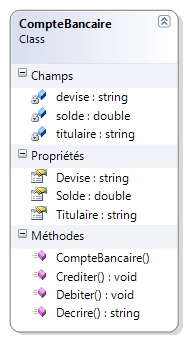

# Principaux concepts objets

L'objectif de ce chapitre est de présenter les concepts essentiels de la programmation orientée objet.

Les exemples de code associés sont [disponibles en ligne](https://github.com/bpesquet/poo-csharp/tree/master/examples).

## Constructeur

Reprenons l'exemple de la classe `CompteBancaire` du chapitre précédent.



Tout compte a nécessairement un titulaire, un solde initial et une devise lors de sa création. On aimerait pouvoir instancier un objet de la classe `CompteBancaire` en définissant directement les valeurs de ses attributs. Pour cela, nous allons ajouter à notre classe une méthode particulière : le **constructeur**.

```csharp
public class CompteBancaire
{
    public string titulaire;
    public double solde;
    public string devise;

    // Constructeur
    public CompteBancaire(string leTitulaire, double soldeInitial, string laDevise)
    {
        titulaire = leTitulaire;
        solde = soldeInitial;
        devise = laDevise;
    }

    // ...
```

### Rôle

**DEFINITION** : le **constructeur** est une méthode spécifique dont le rôle est de construire un objet, le plus souvent en initialisant ses attributs.

**ATTENTION** : le nom du constructeur doit être identique au nom de la classe, et sa définition ne comporte pas le mot-clé `void`.

L'utilisation d'un constructeur se fait au moment de l'instanciation de l'objet (opérateur `new`), en passant en paramètres les futures valeurs des attributs de l'objet créé.

```csharp
// déclaration et instanciation d'un nouvel objet en utilisant son constructeur
CompteBancaire comptePierre = new CompteBancaire("Pierre", 0, "euros");

// appels de méthodes
comptePierre.Crediter(300);
comptePierre.Debiter(500);
Console.WriteLine(comptePierre.Decrire());
```

### Constructeur par défaut

Lorsqu'une classe ne définit aucun constructeur (comme dans l'exemple du chapitre précédent), un constructeur par défaut sans aucun paramètre est implicitement créé. Il n'a aucun comportement mais son existence permet d'instancier des objets de cette classe.

En revanche, toute définition explicite d'un constructeur dans une classe "désactive" le constructeur par défaut. Dans notre exemple actuel, on ne peut plus instancier un compte bancaire sans lui fournir les trois paramètres que son constructeur attend.


**REMARQUE** : une classe peut disposer de plusieurs constructeurs initialisant différents attributs. Nous étudierons cette possibilité dans un [prochain chapitre](06-complements-classes.md).

## Encapsulation

L'écriture de classes offre d'autres avantages que le simple regroupement de données et de traitements. Parmi ceux-ci figure la possibilité de restreindre l'accès à certains éléments de la classe. C'est ce que l'on appelle **l'encapsulation**.

### Exemple d'utilisation

On souhaite qu'un compte bancaire créé ne puisse pas changer de titulaire ni de devise. Cela est possible en définissant les attributs `titulaire` et `devise` comme étant **privés**.

```csharp
public class CompteBancaire
{
    private string titulaire;   // attribut privé
    public double solde;
    private string devise;      // attribut privé

    public CompteBancaire(string leTitulaire, double soldeInitial, string laDevise)
    {
        titulaire = leTitulaire;
        solde = soldeInitial;
        devise = laDevise;
    }

    // ...
```

A présent, la seule manière de définir des valeurs pour `titulaire` et `devise` est d'utiliser le constructeur. Toute tentative d'accès externe aux propriétés privées génèrera une erreur lors de la compilation.

```csharp
CompteBancaire comptePierre = new CompteBancaire("Pierre", 0, "euros");

comptePierre.titulaire = "Pierre";  // Erreur : titulaire est un attribut privé
comptePierre.solde = 500;           // OK : solde est un attribut public
comptePierre.devise = "euros";      // Erreur : devise est un attribut privé
```

### Définition

Les mots-clés `public` et `private` permettent de modifier le **niveau d'encapsulation** (on parle aussi de **visibilité** ou **d'accessibilité**) des éléments de la classe (attributs et méthodes) :

* un élément **public** est librement utilisable depuis le reste du programme.
* un élément **privé** est uniquement utilisable depuis les méthodes de la classe elle-même.

**REMARQUE** : dans de nombreux langages dont le C#, il existe un niveau d'encapsulation intermédiaire (``protected``) qui sera étudié plus loin.

**DEFINITION** : **l'encapsulation** est l'un des principes fondamentaux de la POO. Il consiste à restreindre l'accès à certains éléments d'une classe (le plus souvent ses attributs). L'objectif de l'encapsulation est de ne laisser accessible que le strict nécessaire pour que la classe soit utilisable.

**CONSEIL** : sauf cas particulier, on donne le niveau de visibilité `private` à tous les attributs d'une classe afin d'assurer leur encapsulation par défaut.

```csharp
public class CompteBancaire
{
    private string titulaire;
    private double solde;
    private string devise;

    // ...
```

### Avantages

L'encapsulation offre de nombreux avantages :

* diminution des risques de mauvaise manipulation d'une classe.
* création de classes "boîtes noires" par masquage des détails internes.
* possibilité de modifier les détails internes d'une classe (la manière dont elle fonctionne) sans changer son comportement extérieur (ce qu'elle permet de faire).

## Accesseurs

L'encapsulation des attributs a permis d'interdire toute modification (accidentelle ou volontaire) des données d'un compte bancaire. Cependant, il est maintenant impossible de consulter le solde, le titulaire ou la devise d'un compte créé, ce qui est gênant. On aimerait pouvoir accéder aux données de la classe, tout en maintenant un certain niveau de contrôle. Cela est possible en ajoutant des **accesseurs** à la classe.

### Définition

**DEFINITION** : un **accesseur** est une méthode le plus souvent *publique* qui permet d'accéder à un attribut *privé*.

* un accesseur en lecture (*getter*) permet de **lire** la valeur d'un attribut.
* un accesseur en écriture (mutateur ou *setter*) permet de **modifier** la valeur d'un attribut.

### Spécificités du langage C♯

En C#, les accesseurs prennent la forme de **propriétés**. Une propriété se manipule comme un champ, mais il s'agit en réalité d'un couple d'accesseurs *get* et *set*. Dans la plupart des autres langages, les accesseurs sont des méthodes de la forme `getXXX` et `setXXX`.

Voici la classe `CompteBancaire` modifiée pour intégrer des accesseurs vers ses attributs, ainsi que son nouveau diagramme de classe.

```csharp
public class CompteBancaire
{
    private string titulaire;
    private double solde;
    private string devise;

    public string Titulaire
    {
        get { return titulaire; }
        set { titulaire = value; }
    }

    public double Solde
    {
        get { return solde; }
        set { solde = value; }
    }

    public string Devise
    {
        get { return devise; }
        set { devise = value; }
    }

    // ...
```



Depuis la version 3 du langage, on peut définir les propriétés de manière automatique. Dans ce cas, l'attribut disparaît de la définition de le classe : sa présence est implicite. Voici l'exemple précédent réécrit en utilisant des propriétés automatiques.

```csharp
public class CompteBancaire
{
    public string Titulaire { get; set; }

    public double Solde { get; set; }

    public string Devise { get; set; }

    // ...
```

Cette syntaxe permet de gagner en concision si, comme le plus souvent, les accesseurs se contentent de donner accès à l'attribut sous-jacent sans rien faire de particulier.

**DANGER !** Ne pas confondre un champ ou attribut (qui, par convention, commence par une lettre minuscule) avec une propriété au sens du C# (qui commence toujours par une lettre majuscule). **Une propriété C# est un accesseur vers un champ**.

### Avantages

Voici un exemple d'utilisation des accesseurs définis précédemment.

```csharp
CompteBancaire comptePierre = new CompteBancaire("Pierre", 1000, "euros");

// utilisation des propriétés (accesseurs)
string titulaireCompte = comptePierre.Titulaire;  // en lecture (getter)
comptePierre.Solde = 500;                         // en écriture (setter)
comptePierre.Devise = "dollars";                  // en écriture (setter)
```

En remplaçant l'accès direct à un attribut par l'utilisation d'une méthode, un accesseur permet d'effectuer des contrôles supplémentaires : respect d'une plage de valeurs, accès en lecture uniquement, etc.

### Attributs en lecture seule

On observe dans l'exemple ci-dessus qu'il est à nouveau possible de modifier directement les données d'un compte. Pour interdire ces modifications tout en permettant de lire les informations d'un compte, il suffit de supprimer les accesseurs en écriture (*setters*).

```csharp
public class CompteBancaire
{
    private string titulaire;
    private double solde;
    private string devise;

    public string Titulaire
    {
        get { return titulaire; }
    }

    public double Solde
    {
        get { return solde; }
    }

    public string Devise
    {
        get { return devise; }
    }

    // ...
```

Avec des propriétés automatiques, on peut seulement jouer sur le niveau de visibilité des accesseurs. La version 6 du langage C#, sortie en 2015, permet d'avoir réellement des propriétés automatiques en lecture seule ([Plus de détails](http://stackoverflow.com/questions/2480503/is-read-only-auto-implemented-property-possible)).

```csharp
public class CompteBancaire
{
    public string Titulaire { get; private set; }
    // public string Titulaire { get; } // Incorrect avant C# 6 (.NET framework 4.6)

    public double Solde { get; private set; }

    public string Devise { get; private set; }

    // ...
```

A présent, l'accès aux champs est toujours possible, mais toute tentative de modification des données sera refusée.

```csharp
CompteBancaire comptePierre = new CompteBancaire("Pierre", 1000, "euros");

string titulaireCompte = comptePierre.Titulaire;  // OK : le getter existe
comptePierre.Solde = 500;                         // Erreur : pas de setter
comptePierre.Devise = "dollars";                  // Erreur : pas de setter
```