# Gestion des objets en mémoire

L’objectif de ce chapitre est de découvrir les spécificités des variables de type objet, ainsi que la notion de **référence**.

Les exemples de code associés sont [disponibles en ligne](https://github.com/bpesquet/poo-csharp-exemples/tree/master/Chap3-Memoire).

## Préambule

Ce chapitre utilise une classe `Cercle` définie de la manière suivante.

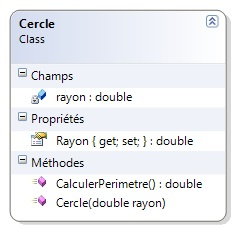

```csharp
// Modélise un cercle
public class Cercle
{
    private double rayon;  // rayon du cercle

    public double Rayon
    {
        get { return rayon; }
        set { rayon = value; }
    }

    // constructeur
    public Cercle(double rayon)
    {
        this.rayon = rayon;
    }

    // calcule le périmètre du cercle
    public double CalculerPerimetre()
    {
        double perimetre = 2 * Math.PI * rayon;
        return perimetre;
    }
}
```

## Création d’un nouvel objet

Nous savons déjà que la création d’un nouvel objet se fait en deux étapes :

1. **déclaration** de l’objet
2. **instanciation** de l’objet

Le code ci-dessous crée un nouvel objet `monCercle` de la classe `Cercle`.

```csharp
Cercle monCercle;             // déclaration
monCercle = new Cercle(7.5);  // instanciation
```

On peut rassembler ces deux étapes sur une seule ligne. Cependant, il est important de bien les distinguer conceptuellement.

```csharp
Cercle monCercle = new Cercle(7.5);   // déclaration et instanciation
```

Avant son instanciation, la “valeur” d’un objet en mémoire, observable au débogueur, est `null`. Elle correspond à un objet non instancié. L’instanciation permet de réserver une zone mémoire spécifique pour y stocker les données de l’objet.

## Affectation d’objets

### La spécificité des objets

Nous allons découvrir une différence fondamentale entre le fonctionnement d’une variable de type prédéfini (types C# de base : `int`, `double`, `bool`, etc) et le fonctionnement d’un objet.

Le code suivant utilise deux variables entières.

```csharp
int nombre1;
nombre1 = 5;
int nombre2 = 3;

nombre2 = nombre1;
nombre1 = 10;

Console.WriteLine("nombre1 = " + nombre1);
Console.WriteLine("nombre2 = " + nombre2);
```

A la fin de son exécution, la variable `nombre1` vaut 10 et la variable `nombre2` vaut 5. Pas de surprise ici.

Ecrivons un code similaire, mais qui utilise cette fois deux variables objets.

```csharp
Cercle cercle1;           // déclaration
cercle1 = new Cercle(5);  // instanciation
Cercle cercle2 = new Cercle(3);   // déclaration et instanciation

cercle2 = cercle1;
cercle1.Rayon = 10;

Console.WriteLine("cercle1.Rayon = " + cercle1.Rayon); // 10
Console.WriteLine("cercle2.Rayon = " + cercle2.Rayon); // 10 (???)
```

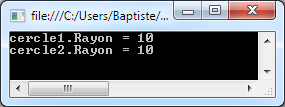

A la fin de l'exécution, le rayon de `cercle1` vaut `10` et celui de `cercle2` vaut... `10`.


Le résultat précédent devrait vous surprendre... On peut le compléter en observant ce qui se passe au débogueur. Voici le contenu des variables avant le changement du rayon de `cercle1`.

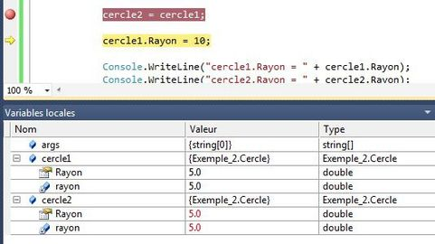

Et voici le contenu des variables *après* le changement du rayon de `cercle1`.

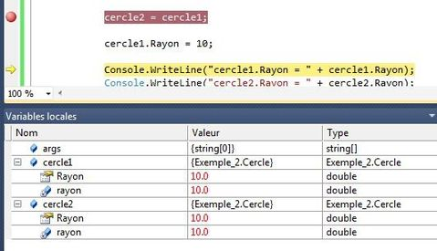

L'instruction `cercle1.Rayon = 10` a simultanément modifié le rayon de `cercle2`. Comment expliquer ce mystère ?

### La notion de référence

Revenons à notre exemple initial. Nous savons que la création d'une variable déclenche la réservation en mémoire d'une zone dédiée au stockage de sa valeur.

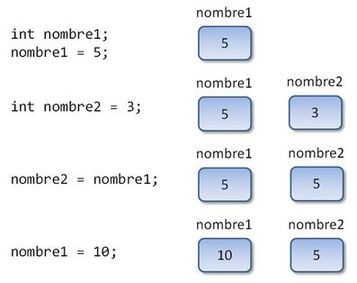

Les variables `nombre1` et `nombre2` correspondent à des zones mémoire distinctes. Toute modification de l'une (exemple : `nombre1 = 10`) n'a aucun impact sur l'autre.

Les objets fonctionnent de manière différente. Une variable objet ne stocke pas directement les données de l'objet, mais une **référence** vers l'emplacement mémoire où se trouvent ces données. De manière simpliste, on peut considérer une référence comme une adresse mémoire.

Une instanciation d'objet comme `monCercle = new Cercle(7.5)` provoque la réservation d'une zone mémoire pour stocker les données de l'objet, et affecte à la variable `monCercle` la référence vers cette zone mémoire.

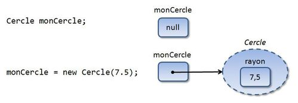

Les observations précédentes ont maintenant une explication : l'affectation `cercle2 = cercle1` provoque la copie de la **référence** de `cercle1` dans `cercle2`. Après cette assignation, les deux variables "pointent" vers la même zone mémoire contenant les données du premier cercle.

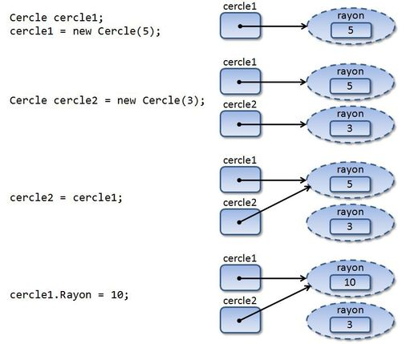

**DEFINITION** : l'affectation d'un objet à un autre ne déclenche pas la copie du *contenu* des objets. La **référence** (adresse mémoire) du premier objet est affectée au second, et les deux objets "pointent" vers la même zone mémoire.

Pour dupliquer l'objet lui-même et non sa référence, il faut utiliser d'autres techniques que vous découvrirez ultérieurement.

### Types valeurs et types références

**DEFINITION** : les types de données C# se répartissent en deux catégories :

* les types **valeurs**, où la valeur est directement stockée dans la variable.
* les types **références**, où la variable stocke l'emplacement mémoire de la valeur.

Les types prédéfinis (`int`, `double`, etc) sont des types valeurs. Les classes et les tableaux sont des types référence.

Pourquoi avoir introduit la notion de référence dans le langage ? Essentiellement pour des raisons de performances. Contrairement aux types valeur, un objet (ou une liste d'objets) peut occuper une taille non négligeable en mémoire. De trop nombreuses copies d'objets auraient donc pu ralentir l'exécution d'un programme. Grâce aux références, une affectation entre objets est quasi-instantanée : la seule information copiée est une adresse mémoire, et non l'objet lui-même.

Le langage Java fait aussi la distinction entre types valeurs et références ([Parameter passing in Java](http://www.yoda.arachsys.com/java/passing.html)). Les objets en Python stockent également des références. Le langage C++ va encore plus loin : il distingue références et *pointeurs*.

Il est très important de savoir si une variable est de type valeur ou de type référence car cela a un impact sur la comparaison d'objets et le passage d'un objet en paramètre.

## Comparaison d'objets

Etudions ce qui ce produit lorsque l'on compare deux variables de type valeur, comme des entiers.

```csharp
int nombre1;
nombre1 = 5;

int nombre2 = 3;

if (nombre1 == nombre2)
   Console.WriteLine("nombre1 et nombre2 sont égaux");
else
   Console.WriteLine("nombre1 et nombre2 sont différents");

nombre2 = 5;

if (nombre1 == nombre2)
   Console.WriteLine("nombre1 et nombre2 sont égaux");
else
   Console.WriteLine("nombre1 et nombre2 sont différents");
```

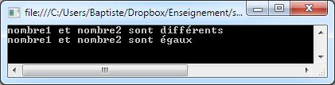

L'exécution de ce code indique d'abord que les variables sont différentes, puis qu'elles sont égales. Ceci est attendu puisque nous avons donné à `nombre2` la même valeur que `nombre1`.

Ecrivons un code similaire, mais qui utilise des objets.

```csharp
Cercle cercle1;
cercle1 = new Cercle(5);

Cercle cercle2 = new Cercle(3);

if (cercle1 == cercle2)
   Console.WriteLine("cercle1 et cercle2 sont égaux");
else
   Console.WriteLine("cercle1 et cercle2 sont différents");

cercle2.Rayon = 5;

if (cercle1 == cercle2)
   Console.WriteLine("cercle1 et cercle2 sont égaux");
else
   Console.WriteLine("cercle1 et cercle2 sont différents");
```

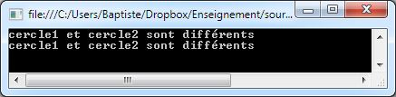

Son exécution indique que les objets sont différents, puis qu'ils sont différents. Et pourtant, leurs états (valeur du rayon) sont identiques... Pour comprendre, il est utile de représenter ce qui se passe en mémoire pendant l'exécution.

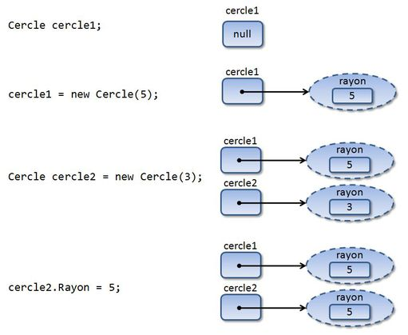

Le contenu des deux objets est bien identique, mais ils se trouvent à des emplacements mémoire distincts. Les variables `cercle1` et `cercle2` stockent des références vers deux objets distincts, qui dans ce cas particulier ont le même état.

L'expression `cercle1 == cercle2` compare les valeurs des références et non les états des objets eux-mêmes : elle renvoie toujours false dans notre exemple.

La notion "d'égalite d'objets" est donc plus complexe qu'elle n'y paraît. Ici encore, il existe d'autres techniques pour comparer les objets et non leurs références.

## Passage d'un objet en paramètre

Il est important de comprendre la manière dont un objet est passé en paramètre à un sous-programme ou à une méthode. Pour cela, nous allons revenir en détail sur le fonctionnement du passage de paramètre.

Le code ci-dessous permet d'illustrer le passage d'un paramètre entier.

```csharp
static void Main(string[] args)
{
   int nombre = 5;

   Console.WriteLine("Avant l'appel, nombre = " + nombre);
   Augmenter(nombre);
   Console.WriteLine("Après l'appel, nombre = " + nombre);
}

static void Augmenter(int unNombre)
{
   Console.WriteLine("Avant l'augmentation, unNombre = " + unNombre);
   unNombre = unNombre + 1;
   Console.WriteLine("Après l'augmentation, unNombre = " + unNombre);
}
```

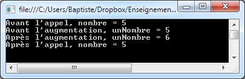

Nous savons expliquer ce résultat : il est dû au fait que les paramètres sont passé par **valeur**. Au moment de l'appel à `Augmenter`, la valeur de l'argument `nombre` est copiée dans l'espace mémoire du paramètre `unNombre`. La même valeur 5 est donc stockée à deux emplacements mémoire distincts. Toute modification de `unNombre` dans le sous-programme n'aura aucun impact sur la valeur de `nombre` dans le programme principal.

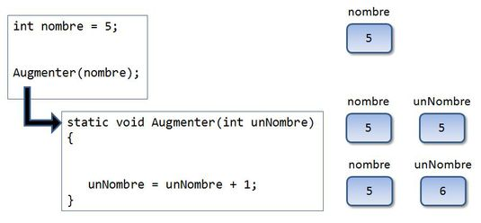

Voyons à présent ce qui se produit dans le cas d'objets.

```csharp
static void Main(string[] args)
{
   Cercle cercle = new Cercle(5);

   Console.WriteLine("Avant l'appel, cercle.Rayon = " + cercle.Rayon);
   AugmenterRayon(cercle);
   Console.WriteLine("Après l'appel, cercle.Rayon = " + cercle.Rayon);
}

static void AugmenterRayon(Cercle unCercle)
{
   Console.WriteLine("Avant l'augmentation, unCercle.Rayon = " + unCercle.Rayon);
   unCercle.Rayon = unCercle.Rayon + 1;
   Console.WriteLine("Après l'augmentation, unCercle.Rayon = " + unCercle.Rayon);
}
```

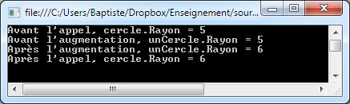

L'appel au sous-programme a modifié la valeur de l'objet ! Ceci semble contradictoire avec le mode de passage des paramètres par valeur, où l'argument est copié dans le paramètre.

Tentons de comprendre pourquoi avec une représentation mémoire de l'exécution.

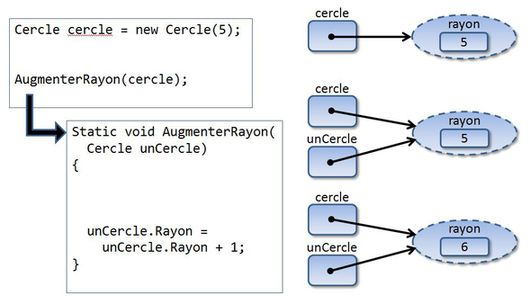

Au moment de l'appel du sous-programme, la valeur de l'argument `cercle`, autrement dit la référence vers l'objet associé, est copiée dans le paramètre `unCercle`. Les variables `cercle` et `unCercle` contiennent la même référence et "pointent" donc vers le même emplacement mémoire. Cela explique que la modification faite dans le sous-programme ait un impact au niveau du programme principal : l'objet référencé est le même.

**DEFINITION** : par défaut, **tous les paramètres sont passés par valeur en C#**.

* Dans le cas d'un type **valeur**, la valeur est copiée de l'argument vers le paramètre. Paramètre et argument concernent des zones mémoires différentes. Les modifications du paramètre n'ont pas d'impact sur l'argument.
* Dans le cas d'un type **référence**, la référence est copiée de l'argument vers le paramètre. Paramètre et argument concernent la même zone mémoire. Les modifications du paramètre modifient aussi l'argument.

## Destruction d'un objet

L'instanciation d'un objet provoque la réservation d'espace mémoire. Sans libération de cet espace une fois que l'objet sera devenu inutile, le risque existe d'une saturation de la mémoire de l'application, voire du système.

Dans certains langages comme le C++, la libération de la mémoire est de la responsabilité du programmeur, ce qui est source de problèmes complexes. Heureusement pour vous, le C# a suivi l'exemple de Java et dispose d'une fonctionnalité de libération mémoire automatique appelée **ramasse-miettes** (*garbage collector*).

Cela fonctionne de manière simple : tout objet, une fois qu'il n'est plus pointé par aucune référence, devient éligible pour la destruction (c'est-à-dire la libération de l'espace mémoire associé).

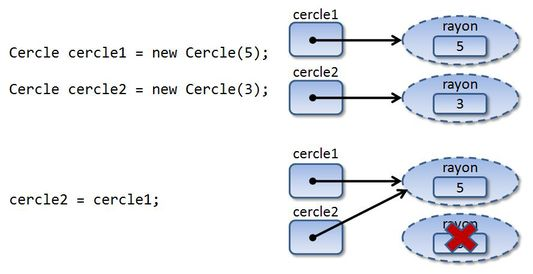

Dans l'exemple ci-dessus, l'objet initialement pointé par `cercle2` n'est plus pointé par aucune référence et sera prochainement détruit automatiquement par le ramasse-miettes.
