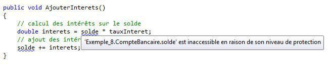

# La relation d'héritage

L'héritage est l'un des mécanismes fondamentaux de la POO. Il permet de créer des classes à partir de classes existantes. L'objectif de ce chapitre est de découvrir son fonctionnement.

Les exemples de code associés sont [disponibles en ligne](https://github.com/bpesquet/poo-csharp-exemples/tree/master/Chap5-Heritage).

## Premiers pas

### Exemple d'utilisation

Reprenons nos classes `CompteBancaire` et `Client`, et supposons que nous ayons à gérer un nouveau type de compte : le compte épargne. Comme un compte classique, un compte épargne possède un titulaire, un solde et une devise. Sa spécificité est qu'il permet d'appliquer des intérêts à l'argent déposé sur le compte.

Bien sûr, il serait possible de concevoir une classe `CompteEpargne` totalement distincte de la classe `CompteBancaire`. Cependant, on constate qu'un compte épargne possède toutes les caractéristiques d'un compte bancaire plus des caractéristiques spécifiques. Nous allons donc définir un compte épargne par **héritage** de la définition d’un compte bancaire.

```csharp
public class CompteEpargne : CompteBancaire
{
    private double tauxInteret;

    public CompteEpargne(Client leTitulaire, double soldeInitial, string laDevise, double leTauxInteret) 
        : base(leTitulaire, soldeInitial, laDevise)
        // appel du constructeur de la classe CompteBancaire
        // le mot-clé "base" permet d'accéder à la classe parente
    {
        tauxInteret = leTauxInteret;
    }

    // Calcule et ajoute les intérêts au solde du compte
    public void AjouterInterets()
    {
        // ... (détaillé plus bas)
    }
}
```

Dans la déclaration `class CompteEpargne : CompteBancaire`, les deux-points spécifient que la classe `CompteEpargne` hérite de la classe `CompteBancaire`.

**REMARQUE** : d'autres langages comme Java ou PHP utilisent le mot-clé ``extends`` plutôt que le symbole ``:`` pour indiquer une relation d'héritage entre deux classes.

On observe que le constructeur de `CompteEpargne` fait appel au constructeur de `CompteBancaire` pour en initialiser les attributs. Le mot-clé `base` désigne la classe parente. Le constructeur de `CompteEpargne` initialise également l'attribut `tauxInteret` qui lui est propre.

### Représentation graphique

Le formalisme graphique UML décrit la relation d'héritage entre deux classes par une **flèche pleine** allant de la classe dérivée à la classe de base (les propriétés C# de `CompteBancaire` ont été masquées afin d'alléger le diagramme).


### Définition

**DEFINITION** : **l'héritage** est un mécanisme objet qui consiste à définir une classe à partir d'une classe existante. Une classe héritant d'une autre classe possède les caractéristiques de la classe initiale et peut définir ses propres éléments.

La nouvelle classe (ou classe **dérivée**) correspond à une **spécialisation** de la classe de base (appelée classe **parente** ou **superclasse**). On dit que l'héritage crée une relation de type **est un** entre les classes. Dans notre exemple, un compte épargne *est un* type particulier de compte bancaire.

**ATTENTION** : le constructeur d'une classe dérivée doit obligatoirement faire appel au constructeur de la classe parente lorsque celui-ci prend des paramètres. C'est le cas dans notre exemple.

### Avantages

Grâce à la relation d'héritage, un objet de la classe `CompteEpargne` peut utiliser les fonctionnalités de la classe `CompteBancaire` sans avoir à les redéfinir. On peut donc débiter ou créditer un compte épargne exactement comme un compte bancaire.

```csharp
Client paul = new Client(987654, "Ochon", "Paul");

double tauxInteret = 0.05;  // taux d'intérêt : 5%
CompteEpargne comptePaul = new CompteEpargne(paul, 100, "dollars", tauxInteret);

// appel des méthodes de CompteBancaire sur le compte épargne
comptePaul.Debiter(1000);
comptePaul.Crediter(1500);
Console.WriteLine(comptePaul.Decrire()); // Affiche 600 $
```

Par contre, le calcul des intérêts (méthode `AjouterInterets`) ne peut se faire que sur un objet de la classe `CompteEpargne`. L'héritage est une relation *unidirectionnelle*.

```csharp
// OK : comptePaul est un compte épargne
comptePaul.AjouterInterets();
Console.WriteLine(comptePaul.Decrire());
            
CompteBancaire autreComptePaul = new CompteBancaire(paul, 100, "dollars");
// Erreur : autreComptePaul est un compte bancaire, pas un compte épargne
autreComptePaul.AjouterInterets();
```

Grâce à l'héritage, il est possible de réutiliser les fonctionnalités d'une classe existante en la spécialisant. Il est également possible de spécialiser une classe dérivée.

On voit bien tous les avantages que l'héritage peut apporter : gain de temps de développement, amélioration de la qualité du code, création de hiérarchies de classes reflétant précisément le domaine d'étude, etc.

### Héritage et encapsulation

Nous avons volontairement laissé de côté un point délicat. La méthode `AjouterInterets` de la classe `CompteEpargne`, qui doit ajouter les intérêts au solde, n'est pas encore définie. En voici une première version.

```csharp
public class CompteEpargne : CompteBancaire
{
    // ...

    public void AjouterInterets()
    {
        // calcul des intérêts sur le solde
        double interets = solde * tauxInteret;
        // ajout des intérêts au solde
        solde += interets;
    }
}
```

Cependant, le compilateur nous signale l'erreur suivante.



Dans cet exemple, la classe dérivée `CompteEpargne` tente d'accéder à l'attribut `solde` qui appartient à la classe de base `CompteBancaire`. Cependant, cet attribut est défini avec le niveau de visibilité `private` ! Cela signifie qu'il n'est utilisable que dans la classe où il est défini, et non dans les classes dérivées.

Pour interdire l'accès à un membre d'une classe (attribut, propriété C# ou méthode) depuis l'extérieur tout en permettant son utilisation par une classe dérivée, il faut associer à ce membre un niveau de visibilité intermédiaire : `protected`.

```csharp
public class CompteBancaire
{
    private string titulaire;
    protected double solde;   // attribut protégé
    private string devise;

    // ...
```

Une autre solution à ce problème consiste à laisser le champ `solde` privé et à définir un accesseur *protégé* pour modifier le solde depuis les méthodes de la classe `CompteEpargne`.

```csharp
public class CompteBancaire
{
    private string titulaire;
    private double solde;
    private string devise;

    // ...

    public double Solde
    {
        get { return solde; }             // accesseur public pour la lecture
        protected set { solde = value; }  // mutateur protégé pour la modification
    }

    // ...
```

Bien entendu, il faut alors utiliser le mutateur `Solde` et non plus l'attribut `solde` pour accéder au solde depuis la classe dérivée.

```csharp
public class CompteEpargne : CompteBancaire
{
    // ...

    public void AjouterInterets()
    {
        // utilisation du mutateur Solde pour accéder au solde du compte
        double interets = Solde * tauxInteret;
        Solde += interets;
    }
}
```

Le tableau ci-dessous rassemble les trois niveaux de visibilité utilisables.

Visibilité | Classe| Classes dérivées | Extérieur
-----------|:-----:|:----------------:|:--------:
`public` | X | X | X
`protected` | X | X |
`private` | X ||

## Polymorphisme

Afin de gagner en généricité, on peut appliquer le même code à des objets de types différents, lorsque les classes de ces objets sont liées par héritage. C'est le principe du **polymorphisme**.

Prenons l'exemple d'une liste de comptes bancaires dont l'un est un compte épargne.

```csharp
Client paul = new Client(987654, "Ochon", "Paul");

CompteBancaire compte1 = new CompteBancaire(paul, 300, "euros");
CompteEpargne compte2 = new CompteEpargne(paul, 200, "dollars", 0.05);
CompteBancaire compte3 = new CompteBancaire(paul, 5000, "yens");

List<CompteBancaire> listeComptes = new List<CompteBancaire>();
listeComptes.Add(compte1);
listeComptes.Add(compte2); // Est-ce bien un compte bancaire ?
listeComptes.Add(compte3);

foreach (CompteBancaire compte in listeComptes)
    Console.WriteLine(compte.Decrire());
```


Un compte épargne "est un" compte bancaire. On peut donc stocker un compte épargne dans une liste de comptes bancaires. On peut même appeler la méthode `Decrire` sur chacun des éléments de la liste de comptes bancaires. C'est un exemple très simple de ce qu'on appelle le **polymorphisme**.

**DEFINITION** : utiliser le **polymorphisme** consiste à écrire un code générique qui pourra s'appliquer à des objets appartenant à des classes différentes.

Le polymorphisme rend le code plus concis, plus élégant et plus sûr. C'est un mécanisme à utiliser dès que l'occasion se présente. Il peut être enrichi grâce aux mécanismes que nous allons découvrir maintenant.

## Classes et méthodes abstraites

### Evolution des besoins

Nous obtenons les précisions suivantes sur notre domaine d'étude :

* un compte bancaire est soit un compte courant, soit un compte épargne.
* un compte courant se caractérise par le numéro de la carte bancaire qui lui est associée, ainsi que par un découvert maximal autorisé. Tout retrait qui ferait passer le nouveau solde en dessous du découvert maximal est interdit et non effectué.
* on ne peut retirer en une seule fois plus de la moitié du solde d'un compte épargne.

### Création d'une classe abstraite

Notre modélisation objet du domaine doit refléter ces évolutions. Jusqu'à présent, un compte épargne hérite de toutes les caractéristiques d'un compte bancaire, et en ajoute d'autres (taux d'intérêt). Nous voyons apparaître des éléments spécifiques à un compte courant : numéro de CB, découvert maximal. Il serait maladroit d'ajouter ces attributs à la classe `CompteBancaire`, puisqu'ils seraient hérités par la classe `CompteEpargne` alors qu'ils ne la concernent pas.

La bonne solution est de placer dans la classe `CompteBancaire` les éléments communs à tous les types de comptes. Deux autres classes, `CompteCourant` et `CompteEpargne`, héritent de `CompteBancaire` afin d'intégrer ces éléments communs. Chaque classe dérivée contient ce qui est spécifique à chaque type de compte. Le diagramme ci-dessous reflète cette modélisation.


Une instance de `CompteCourant` ou de `CompteEpargne` représente respectivement un compte courant ou un compte épargne. Ce sont des concepts concrets du domaine d'étude.

En revanche, que représenterait une instance de `CompteBancaire` ? Un compte bancaire est soit un compte courant, soit un compte épargne. Un compte bancaire en général n'a pas d'existence concrète. La classe `CompteBancaire` est une **abstraction** destinée à factoriser ce qui est commun à tous les comptes, mais pas à être instanciée.

Pour refléter cela, on définit la classe `CompteBancaire` comme étant abstraite.

```csharp
public abstract class CompteBancaire
{
    // ...
}
```

En C# (ainsi qu'en Java et en C++), le mot-clé `abstract` permet de préciser qu'une classe est abstraite. Dans un diagramme de classe UML, le nom d'une classe abstraite est écrit en *italiques*.


**DEFINITION** : une **classe abstraite** définit un concept abstrait, incomplet ou théorique. Elle rassemble des éléments **communs** à plusieurs classes dérivées. **Elle n'est pas destinée à être instanciée**.

Par opposition aux classes abstraites, les classes instanciables sont parfois appelées classes **concrètes**.

### Modélisation des caractéristiques

Il est maintenant nécessaire de compléter nos classes en y ajoutant les attributs reflétant les caractéristiques (données) des éléments du domaine.

Tout compte possède un solde et une devise. Un compte courant se caractérise par un numéro de carte bancaire et un découvert maximal autorisé. Quant à un compte épargne, il est défini par son taux d'intérêt. On peut donc imaginer la modélisation ci-dessous pour les attributs des classes.


### Modélisation du comportement

Les constructeurs de chaque classe sont simples à définir : ils doivent initialiser leurs attributs. Les constructeurs de `CompteCourant` et `CompteEpargne` feront appel à celui de `CompteBancaire` afin d'initialiser les attributs communs.

Les opérations qu'on souhaite appliquer aux comptes sont :

* le dépot d'argent (crédit).
* le retrait d'argent (débit).
* la description du compte.

Le dépôt d'argent fonctionne de la même manière pour tous les types de comptes : le solde est simplement augmenté du montant. Ce n'est pas le cas du débit. Chaque type de compte peut être débité, mais de manière très différente :

* un compte courant autorise un découvert maximal.
* un compte épargne limite le montant du retrait par rapport au solde.

### Déclaration d'une méthode abstraite

Pour traiter la problématique du débit d'argent, il faudrait pouvoir déclarer une opération de débit dans la superclasse `CompteBancaire` et laisser les classes dérivées définir comment cette opération est effectuée.

Il existe une technique pour obtenir ce résultat : la définition d'une **méthode abstraite**.

On modifie la classe `CompteBancaire` pour rendre la méthode `Debiter` abstraite, en la faisant précéder du mot-clé `abstract`.

```csharp
public abstract class CompteBancaire
{
    private Client titulaire;
    private double solde;
    private string devise;

    public CompteBancaire(Client leTitulaire, double soldeInitial, string laDevise)
    {
        titulaire = leTitulaire;
        solde = soldeInitial;
        devise = laDevise;
    }

    public double Solde
    {
        get { return solde; }
        protected set { solde = value; }
    }

    public string Devise
    {
        get { return devise; }
    }

    public string Titulaire
    {
        get { return titulaire; }
    }

    public void Crediter(double montant)
    {
        solde += montant;
    }

    // La méthode Debiter est maintenant abstraite
    public abstract void Debiter(double montant);

    public string Decrire()
    {
        return "Le solde du compte de " + titulaire + " est de " + solde + " " + devise;
    }
}
```

Remarquez l'absence d'accolades ouvrantes et fermantes après le nom `Debiter`, remplacées par un simple `;`. La méthode est *déclarée* mais pas *définie*. Ce sera aux classes qui héritent de `CompteBancaire` de fournir une implémentation respectant la signature de la méthode.

**DEFINITIONS**

* Le terme **implémenter** signifie : rendre concret, traduire en code.
* La **signature** d'une méthode est constituée de son nom et de la liste de ses paramètres.

**ATTENTION** : il faut bien faire la distinction entre une déclaration et une définition.

* **Déclarer** une méthode, c'est dire ce que doit faire cette méthode, sans dire comment.
* **Définir** une méthode, c'est dire comment cette méthode fait ce qu'elle doit faire, autrement dit l'implémenter.

On constate que notre classe `CompteCourant` actuelle ne compile plus : il est obligatoire d'y redéfinir la méthode `Debiter`.


### Redéfinition d'une méthode abstraite

On ajoute dans la classe `CompteCourant` la méthode `Debiter` requise, avec la même signature que celle de la superclasse.

```csharp
public class CompteCourant : CompteBancaire
{
    private string numeroCB;
    private double decouvertMaxi;

    // Constructeur
    public CompteCourant(Client leTitulaire, double soldeInitial, string laDevise, string numeroCB, double decouvertMaxi)
        : base(leTitulaire, soldeInitial, laDevise)  // appel au constructeur de CompteBancaire
    {
        this.numeroCB = numeroCB;
        this.decouvertMaxi = decouvertMaxi;
    }

    // Redéfinition de la méthode Debiter
    public override void Debiter(double montant)
    {
        // on n'effectue le débit que si le solde final reste supérieur au découvert
        if (Solde - montant >= decouvertMaxi)
            Solde -= montant;
    }
}
```

En C#, la redéfinition d'une méthode abstraite doit être précédée du mot-clé `override`. 

Suivant le même principe, on complète la définition de la classe `CompteEpargne` pour préciser de quelle manière un compte épargne est débité.

```csharp
public class CompteEpargne : CompteBancaire
{
    // ...

    // Redéfinition de la méthode Debiter
    public override void Debiter(double montant)
    {
        // Le montant maximal d'un retrait est la moitié du solde actuel
        if (montant <= Solde / 2)
            Solde -= montant;
    }
}
```

On peut maintenant instancier nos classes dérivées et tester leurs fonctionnalités.

```csharp
Client pierre = new Client(123456, "Khiroul", "Pierre");

CompteCourant compteCourant = new CompteCourant(pierre, 250, "dollars", "1234 5678 9123 4567", -500);
compteCourant.Debiter(300);
compteCourant.Debiter(500);
Console.WriteLine(compteCourant.Decrire());
```


On constate que le second retrait de 500 dollars n'a pas eu lieu, puisqu'il aurait fait passer le solde en dessous du découvert maximal autorisé.

**REMARQUE** : le programme principal n'est pas informé de l'échec du second retrait, ce qui peut laisser croire que ce retrait a réussi. Nous découvrirons prochainement le mécanisme de remontée d'erreur qu'on utilise dans ces cas de figure.

```csharp
Client paul = new Client(987654, "Ochon", "Paul");

CompteEpargne compteEpargne = new CompteEpargne(paul, 1000, "euros", 0.04);
compteEpargne.Debiter(300);
compteEpargne.Debiter(500);
Console.WriteLine(compteEpargne.Decrire());
```


Ici encore, le second retrait n'a pas eu lieu : son montant est supérieur à la moitié du solde (700 euros au moment de l'appel).

### Bilan

**DEFINITION** : une **méthode abstraite** (mot-clé `abstract`) déclare un comportement sans le définir. Elle doit être redéfinie (mot-clé `override`) dans toutes les classes dérivées.

Une classe comportant au moins une méthode abstraite est nécessairement une **classe abstraite**.

Déclarer une méthode abstraite dans une superclasse permet d'imposer à toutes les classes dérivées de fournir une implémentation de cette méthode. Ainsi, on demande à ces classes de founir un certain comportement tout en les laissant choisir comment elles procèdent.

## Méthodes virtuelles

### Evolution du contexte

Intéressons-nous à la description d'un compte. Elle devrait renvoyer les données communes (solde, devise) et les données spécifiques au type (numéro de CB, découvert maximal ou taux d'intérêt), ce qui n'est pas le cas actuellement : seuls les attributs de la classe abstraite `CompteBancaire` sont affichés.

Dans ce cas de figure, on voudrait pouvoir utiliser le comportement commun (celui de `CompteBancaire`) et le compléter par un comportement particulier à chaque sous-classe. Pour cela, nous pouvons rendre la méthode `Decrire` virtuelle.

### Mise en oeuvre

Modifiez la défintion de `Decrire` dans `CompteBancaire` pour ajouter le mot `virtual`. Le reste de sa définition ne change pas.

```csharp
public abstract class CompteBancaire
{
    // ...
    
    public virtual string Decrire()
    { // ... }
}
```

En faisant cela, on indique au compilateur que cette méthode est **virtuelle**, autrement dit susceptible d'être *redéfinie* dans une classe dérivée. C'est justement ce que nous allons faire dans `CompteCourant` et `CompteEpargne` pour intégrer à la description les données spécifiques à chaque type de compte.

```csharp
public class CompteCourant : CompteBancaire
{
    // ...
    
    // Redéfinition de la méthode Decrire
    public override string Decrire()
    {
        return base.Decrire() + ". Son numéro CB est " + numeroCB + 
          " et son découvert maxi est de " + decouvertMaxi + " " + Devise + ".";
    }
}

public class CompteEpargne : CompteBancaire
{
    // ...
    
    // Redéfinition de la méthode Decrire
    public override string Decrire()
    {
        return base.Decrire() + ". Son taux d'intérêt est de " + (tauxInteret * 100) + "%.";
    }
}
```

Le mot-clé `base` permet d'accéder aux membres de la classe de base depuis une méthode d'une classe dérivée. Ici, `base.Decrire()` appelle la méthode `Decrire` de `CompteBancaire`.

Nous obtenons le résultat suivant.


A présent, chaque type de compte dispose d'une description spécifique, et la description des informations communes à tous les comptes (titulaire, solde et devise) se fait sans aucune duplication de code.

### Bilan

**DEFINITION** : une méthode **virtuelle** (`virtual`) fournit un comportement par défaut dans une classe. Elle peut être redéfinie (`override`) dans une classe dérivée.

Grâce aux méthodes virtuelles, on pousse encore plus loin les possibilités du polymorphisme.

** ATTENTION** : ne pas confondre méthode virtuelle et méthode abstraite :
* Une méthode virtuelle *définit* un comportement, *éventuellement* redéfini.
* Une méthode abstraite *déclare* un comportement, *obligatoirement* redéfini.
