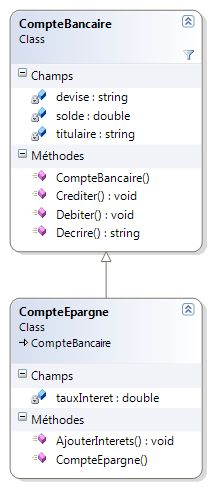
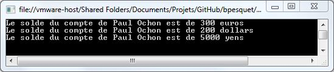
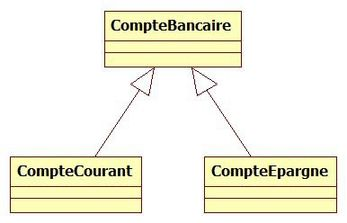
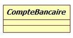
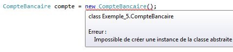
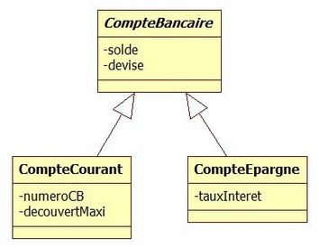
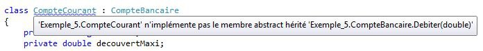
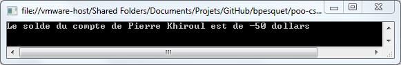
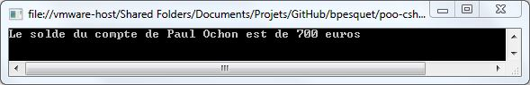
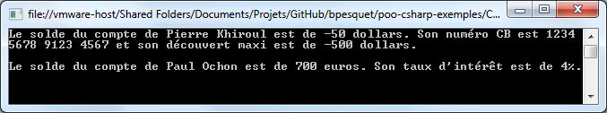

# La relation d'héritage

L'objectif de ce chapitre est d'enrichir notre compréhension de l'héritage et de ses possibilités.

## Contexte d'exemple

Dans un [précédent chapitre](02-principaux-concepts-objets.md), nous avions modélisé un compte bancaire et un compte épargne sous la forme d'une relation d'héritage entre les classes `CompteBancaire` et `CompteEpargne`. Ce chapitre nous a permis de découvrir les grands principes de l'héritage.



## Polymorphisme

Afin de gagner en généricité, on peut appliquer le même code à des objets de types différents, lorsque les classes de ces objets sont liées par héritage.

Prenons l'exemple d'une liste de comptes bancaires dont l'un est un compte épargne.

```csharp
CompteBancaire comptePierre = new CompteBancaire("Pierre", 300, "euros");
CompteEpargne comptePaul = new CompteEpargne("Paul", 200, "dollars", 0.05);
CompteBancaire compteJacques = new CompteBancaire("Jacques", 50, "euros");

List<CompteBancaire> listeComptes = new List<CompteBancaire>();
listeComptes.Add(comptePierre);
listeComptes.Add(comptePaul);     // Est-ce bien un compte bancaire ?
listeComptes.Add(compteJacques);

foreach (CompteBancaire compte in listeComptes)
Console.WriteLine(compte.Decrire());
```



Un compte épargne "est un" compte bancaire. On peut donc considérer un compte épargne comme un compte bancaire, et stocker un compte épargne dans une liste de comptes bancaires. On peut même appeler la méthode `Decrire` sur chacun des éléments de la liste de comptes bancaires. C'est ce qu'on appelle le **polymorphisme**.

**DEFINITION** : utiliser le **polymorphisme** consiste à écrire un code générique qui pourra s'appliquer à des objets de classes différentes.

Le polymorphisme rend le code plus concis, plus élégant et plus sûr. C'est un mécanisme à utiliser lorsque l'occasion se présente.

## Classes et méthodes abstraites

### Evolution des besoins

Nous obtenons les précisions suivantes sur notre domaine d'étude :

* un compte bancaire est soit un compte courant, soir un compte épargne.
* un compte courant se caractérise par le numéro de la carte bancaire qui lui est associée, ainsi que par un découvert maximal autorisé. Tout retrait qui ferait passer le nouveau solde en dessous du découvert maximal est interdit et non effectué.
* on ne peut retirer en une seule fois plus de la moitié du solde d'un compte épargne.

### Création d'une classe abstraite

Notre modélisation objet du domaine doit refléter ces évolutions. Jusqu'à présent, un compte épargne hérite de toutes les caractéristiques d'un compte bancaire, et en ajoute d'autres (taux d'intérêt). Nous voyons apparaître des éléments spécifiques à un compte courant : numéro de CB, découvert maximal. Il serait maladroit d'ajouter ces attributs à la classe `CompteBancaire`, puisqu'ils seraient hérités par la classe `CompteEpargne` alors qu'ils ne la concernent pas.

La bonne solution est de placer dans la classe `CompteBancaire` les éléments communs à tous les types de comptes. Deux autres classes, `CompteCourant` et `CompteEpargne`, héritent de `CompteBancaire` afin d'intégrer ces éléments communs. Chaque classe dérivée contient ce qui est spécifique à chaque type de compte. Le diagramme ci-dessous reflète cette modélisation.



Une instance de `CompteCourant` ou de `CompteEpargne` représente respectivement un compte courant ou un compte épargne. Ce sont des concepts concrets du domaine d'étude.

En revanche, que représenterait une instance de `CompteBancaire` ? Un compte bancaire est soit un compte courant, soit un compte épargne. Un compte bancaire en général n'a pas d'existence concrète. La classe `CompteBancaire` est une **abstraction** destinée à factoriser ce qui est commun à tous les comptes, mais pas à être instanciée.

Pour refléter cela, on définit la classe `CompteBancaire` comme étant abstraite.

```csharp
public abstract class CompteBancaire
{
    // ...
}
```

En C# (ainsi qu'en Java et en C++), le mot-clé `abstract` permet de préciser qu'une classe est abstraite. Dans un diagramme de classe UML, le nom d'une classe abstraite est écrit en *italiques*.



**DEFINITION** : une **classe abstraite** définit un concept abstrait, incomplet ou théorique. Elle rassemble des éléments communs à plusieurs classes dérivées. Elle n'est pas destinée à être instanciée.

On vérifie rapidement qu'une classe abstraite n'est pas instanciable.



Par opposition aux classes abstraites, les classes instanciables sont parfois appelées classes **concrètes**.

### Modélisation des caractéristiques

Il est maintenant nécessaire de compléter nos classes en y ajoutant les attributs reflétant les caractéristiques (données) des éléments du domaine.

Tout compte possède un solde et une devise. Un compte courant se caractérise par un numéro de carte bancaire et un découvert maximal autorisé. Quant à un compte épargne, il est défini par son taux d'intérêt. On peut donc imaginer la modélisation ci-dessous pour les attributs des classes.



### Modélisation du comportement

Les constructeurs de chaque classe sont simples à définir : ils doivent initialiser leurs attributs. Les constructeurs de `CompteCourant` et `CompteEpargne` feront appel à celui de `CompteBancaire` afin d'initialiser les attributs communs.

Les opérations qu'on souhaite appliquer aux comptes sont :

* le dépot d'argent (crédit).
* le retrait d'argent (débit).
* la description du compte.

Le dépôt d'argent fonctionne de la même manière pour tous les types de comptes : le solde est simplement augmenté du montant. Ce n'est pas le cas du débit. Chaque type de compte peut être débité, mais de manière très différente :

* un compte courant autorise un découvert maximal.
* un compte épargne limite le montant du retrait par rapport au solde.

### Déclaration d'une méthode abstraite

Pour traiter la problématique du débit d'argent, il faudrait pouvoir déclarer une opération de débit dans la superclasse `CompteBancaire` et laisser les classes dérivées définir comment cette opération est effectuée.

Il existe une technique pour obtenir ce résultat : la définition d'une **méthode abstraite**.

On ajoute à la classe `CompteBancaire` la méthode `Debiter` précédée du mot-clé `abstract`.

```csharp
public abstract class CompteBancaire
{
    protected string titulaire;
    protected double solde;
    protected string devise;

    public CompteBancaire(string leTitulaire, double soldeInitial, string laDevise)
    {
        titulaire = leTitulaire;
        solde = soldeInitial;
        devise = laDevise;
    }

    public double Solde
    {
        get { return solde; }
    }

    public string Devise
    {
        get { return devise; }
    }

    public string Titulaire
    {
        get { return titulaire; }
    }

    public void Crediter(double montant)
    {
        solde += montant;
    }

    public string Decrire()
    {
        return "Le solde du compte de " + titulaire + " est de " + solde + " " + devise;
    }

    // déclaration d'une méthode abstraite
    public abstract void Debiter(double montant);
}
```

Remarquez l'absence d'accolades ouvrantes et fermantes après le nom `Debiter`, remplacées par un simple `;`. La méthode est *déclarée* mais pas *définie*. Ce sera aux classes qui héritent de `CompteBancaire` de fournir une implémentation respectant la signature de la méthode.

**DEFINITION**

* Le terme **implémenter** signifie : rendre concret, traduire en code.
* La **signature** d'une méthode est constituée de son nom et de la liste de ses paramètres.

**ATTENTION** : il faut bien faire la distinction entre une déclaration et une définition.

* **Déclarer** une méthode, c'est dire ce que doit faire cette méthode, sans dire comment.
* **Définir** une méthode, c'est dire comment cette méthode fait ce qu'elle doit faire, autrement dit l'implémenter.
{}

On constate que notre classe `CompteCourant` actuelle ne compile plus : il est obligatoire d'y redéfinir la méthode `Debiter`.



### Redéfinition d'une méthode abstraite

On ajoute dans la classe `CompteCourant` la méthode `Debiter` requise, avec la même signature que celle de la superclasse.

```csharp
public class CompteCourant : CompteBancaire
{
    private string numeroCB;
    private double decouvertMaxi;

    // Constructeur
    public CompteCourant(string leTitulaire, double soldeInitial, string laDevise, string numeroCB, double decouvertMaxi)
    : base(leTitulaire, soldeInitial, laDevise)  // appel au constructeur de CompteBancaire
    {
        this.numeroCB = numeroCB;
        this.decouvertMaxi = decouvertMaxi;
    }

    // redéfinition de la méthode Debiter
    public override void Debiter(double montant)
    {
        // on n'effectue le débit que si le solde final reste supérieur au découvert
        if (solde - montant >= decouvertMaxi)
            solde -= montant;
    }
}
```

En C#, la redéfinition d'une méthode abstraite doit être précédée du mot-clé `override`. On peut maintenant instancier la classe `CompteCourant` et tester ses fonctionnalités.

```csharp
CompteCourant compte1 = new CompteCourant("Pierre", 250, "dollars", "1234 5678 9123 4567", -500);

compte1.Debiter(300);
compte1.Debiter(500);
Console.WriteLine(compte1.Decrire());
```



On constate que le second retrait de 500 dollars n'a pas eu lieu, puisqu'il aurait fait passer le solde en dessous du découvert maximal autorisé.

**REMARQUE** : le programme principal n'est pas informé de l'échec du second retrait, ce qui peut laisser croire que ce retrait a réussi. Nous découvrirons prochainement le mécanisme de remontée d'erreur qu'on utilise dans ces cas de figure.

On peut maintenant compléter la définition de la classe `CompteEpargne`.

```csharp
public class CompteEpargne : CompteBancaire
{
    private double tauxInteret;

    public CompteEpargne(string leTitulaire, double soldeInitial, string laDevise, double leTauxInteret)
    : base(leTitulaire, soldeInitial, laDevise)  // appel au constructeur de CompteBancaire
    {
        tauxInteret = leTauxInteret;
    }

    public void AjouterInterets()
    {
        double interets = solde * tauxInteret;
        solde += interets;
    }

    // redéfinition de la méthode Debiter
    public override void Debiter(double montant)
    {
        if (montant <= solde / 2)
            solde -= montant;
    }
}
```

Une fois la classe `CompteEpargne` complétée, on peut écrire un petit programme de test.

```csharp
CompteEpargne compte2 = new CompteEpargne("Paul", 1000, "euros", 0.04);

compte2.Debiter(300);
compte2.Debiter(500);
Console.WriteLine(compte2.Decrire());
```



Ici encore, le second retrait n'a pas eu lieu : son montant est supérieur à la moitié du solde (700 euros au moment de l'appel).

### Conclusion

**DEFINITION** : une **méthode abstraite** (mot-clé `abstract`) déclare un comportement sans le définir. Elle doit être redéfinie (mot-clé `override`) dans toutes les classes dérivées.

Une classe comportant au moins une méthode abstraite est nécessairement une **classe abstraite**.

Déclarer une méthode abstraite dans une superclasse permet d'imposer à toutes les classes dérivées de fournir une implémentation de cette méthode. Ainsi, on demande à ces classes de founir un certain comportement tout en les laissant choisir comment elles procèdent.

### Application

Intéressons-nous à la description d'un compte. Elle devrait renvoyer les données communes (solde, devise) et les données spécifiques au type (numéro de CB, découvert maximal ou taux d'intérêt), ce qui n'est pas le cas actuellement.

Nous allons rendre la méthode `Decrire` abstraite dans `CompteBancaire`.

```csharp
public abstract class CompteBancaire
{
    // ...
    public abstract string Decrire();
}
```

Ensuite, il faut redéfinir cette méthode dans les classes dérivées `CompteCourant` et `CompteEpargne`.

```csharp
public class CompteCourant : CompteBancaire
{
    // ...
    public override string Decrire()
    {
        return "Le solde du compte de " + titulaire + " est de " + solde + " " + devise + ". Le n° CB est " + numeroCB + " et le découvert maximum est " + decouvertMaxi;
    }
}

public class CompteEpargne : CompteBancaire
{
    // ...
    public override string Decrire()
    {
        return "Le solde du compte de " + titulaire + " est de " + solde + " " + devise + ". Le taux d'intérêt est " + tauxInteret + "%";
    }
}
```



**REMARQUE** : on observe que le code de description des attributs de `CompteBancaire` est dupliqué dans les classes dérivées. Il existe une technique (non étudiée ici) pour éviter cette duplication : la définition d'une **méthode virtuelle**.


