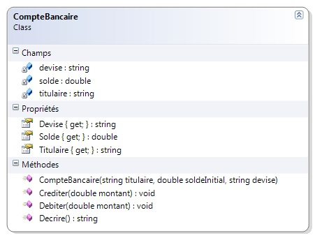
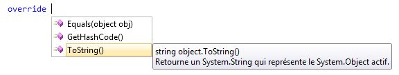
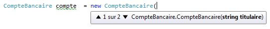
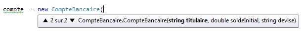
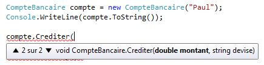
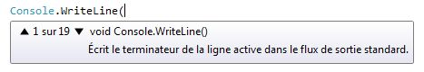
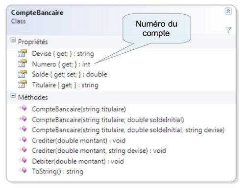
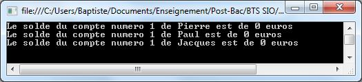
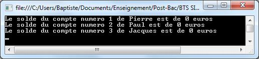
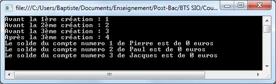

# Compléments sur l'écriture de classes

L'objectif de ce chapitre est de découvrir comment enrichir la définition de nos classes en utilisant certaines possibilités des langages à objets.

## Utilisation des méthodes de base

### Contexte d'exemple

Nous allons découvrir que toute classe C# dispose d'un certain nombre de méthodes de base. Pour cela, nous allons utiliser la classe ci-dessous, issue d'un précédent chapitre.



Le programme de test associé est le suivant.

```csharp
CompteBancaire compte = new CompteBancaire("Pierre", 100, "dollars");
Console.WriteLine(compte.Decrire());
```


## Découverte de la classe Object

Utilisons une fonctionnalité de Visual Studio pour découvrir si des méthodes sont redéfinissables dans `CompteBancaire`. En tapant le mot-clé `override` dans une classe, l'IDE nous propose la liste des méthodes de cette classe qu'il est possible de redéfinir. Etant donné que `CompteBancaire` n'hérite a priori d'aucune classe, on s'attend à ce que cette liste soit vide.



L'IDE nous propose pourtant trois méthodes à redéfinir : `Equals`, `GetHashCode` et `ToString`. Ceci s'explique par le fait que toute classe C# qui n'hérite *explicitement* d'aucune autre hérite *implicitement* d'une classe de base nommée `Object`. Ce design est inspiré de celui du langage Java.

La [documentation Microsoft](http://msdn.microsoft.com/fr-fr/library/system.object.aspx) donne plus de précisions sur cette classe : "Il s'agit de la classe de base fondamentale parmi toutes les classes du .NET Framework. Elle constitue la racine de la hiérarchie des types."

La classe `Object` dispose de plusieurs méthodes. Toute classe C# hérite directement ou indirectement de cette classe et peut utiliser ou redéfinir ses méthodes.

## Redéfinition de ToString

Parmi les méthodes présentes dans la classe `Object`, la plus souvent redéfinie dans les classes dérivées est `ToString`.

**DEFINITION** : la méthode `ToString` permet de décrire un objet sous la forme d'une chaîne de caractères.

**REMARQUE** : c'est cette méthode qui est utilisée lorsqu'un objet est affiché dans un contrôle graphique Winforms (liste déroulante, etc).

Examinons tout d'abord le comportement par défaut (sans redéfinition) de cette méthode.

```csharp
CompteBancaire compte = new CompteBancaire("Pierre", 100, "dollars");
Console.WriteLine(compte.ToString());
```


Par défaut, la méthode `ToString` affiche le nom complet de la classe. Ici, `Exemple_2` désigne **l'espace de noms** (*namespace*) dans lequel la classe `CompteBancaire` est définie.

```csharp
namespace Exemple_2
{
    public class CompteBancaire
    {
        // ...
```

A présent, nous allons redéfinir la méthode `ToString` en lui donnant le même comportement que la méthode `Decrire`.

```csharp
public class CompteBancaire
{
    // ...

    public override string ToString()
    {
        return "Le solde du compte de " + titulaire + " est de " + solde + " " + devise;
    }
}
```


Etant donné que `Decrire` et `ToString` ont exactement le même comportement, il est judicieux de redéfinir `ToString` plutôt que d'ajouter aux classes une méthode `Decrire`. On peut également simplifier le programme principal.

```csharp
CompteBancaire compte = new CompteBancaire("Pierre", 100, "dollars");
Console.WriteLine(compte);  // ToString est appelé implicitement
```

## Surcharge de méthodes

### Définition de plusieurs constructeurs

La classe `CompteBancaire` possède un constructeur qui initialise les attributs du compte créé.

```csharp
public class CompteBancaire
{
    private string titulaire;
    private double solde;
    private string devise;

    public CompteBancaire(string leTitulaire, double soldeInitial, string laDevise)
    {
        titulaire = leTitulaire;
        solde = soldeInitial;
        devise = laDevise;
    }

    // ...
}
```

Ce constructeur nous oblige à définir systématiquement le titulaire, le solde et la devise de tout nouveau compte. Or, les nouveaux comptes bancaires disposent le plus souvent d'un solde égal à zéro et utilisent l'euro comme devise. Pour refléter cet aspect du domaine et faciliter l'utilisation de notre classe, on va y ajouter un autre constructeur. Il prendra uniquement le titulaire en paramètre, et initialisera solde et devise avec leurs valeurs par défaut.

```csharp
// ...

public CompteBancaire(string leTitulaire)
{
    titulaire = leTitulaire;
    solde = 0;
    devise = "euros";
}

// ...
```

On peut à présent instancier un compte bancaire en utilisant ce constructeur. On remarque que Visual Studio nous propose deux choix d'autocomplétion, visualisables à l'aide de petites flèches noires.





Cela signifie qu'il existe à présent deux constructeurs, donc deux manières d'instancier un compte. On choisit d'utiliser le nouveau constructeur.

```csharp
CompteBancaire compte = new CompteBancaire("Paul");
Console.WriteLine(compte);
```


On constate que tous les attributs du compte ont été correctement initialisés.

### Chaînage de constructeurs

Revenons à notre nouveau constructeur. Il est possible d'améliorer sa définition de la manière suivante.

```csharp
// ...

public CompteBancaire(string titulaire) : this(titulaire, 0, "euros")
{
    // Rien à faire !
}

// ...
```

Cette variante n'initialise pas directement les attributs, mais fait appel à l'autre constructeur en lui passant en paramètres des valeurs par défaut pour les attributs que lui-même n'a pas reçus en paramètres.

**CONSEIL** : le chaînage des constructeurs les uns aux autres est une bonne pratique pour éviter la duplication du code d'initialisation des attributs.

Imaginons qu'on souhaite pouvoir instancier un compte bancaire en définissant son titulaire et son solde (la devise par défaut étant toujours l'euro). On va ajouter à notre classe un troisième constructeur en les chaïnant les uns aux autres.

```csharp
// ...

public CompteBancaire(string leTitulaire) : this(leTitulaire, 0)
{}

public CompteBancaire(string leTitulaire, double soldeInitial)
    : this(leTitulaire, soldeInitial, "euros")
{}

public CompteBancaire(string leTitulaire, double soldeInitial, string laDevise)
{
    titulaire = leTitulaire;
    solde = soldeInitial;
    devise = laDevise;
}

// ...
```

### Surcharge d'une méthode

Le mécanisme qui consiste à définir plusieurs constructeurs avec des
signatures différentes s'appelle la **surcharge**.

**DEFINITION** : la **signature** d'une méthode comprend son nom et la liste de ses paramètres (nombre, types et ordre).

On peut également appliquer ce mécanisme pour définir plusieurs méthodes avec des signatures différentes. Par exemple, on pourrait vouloir créditer (ou débiter) un compte avec un montant exprimé dans une devise différente. La solution logique est de créer une nouvelle méthode `Crediter` (ou `Debiter`) prenant en paramètres montant et devise du montant.

```csharp
// ...

public void Crediter(double montant)
{
    solde += montant;
}

public void Crediter(double montant, string devise)
{
    if (devise == Devise)  // ou devise == this.devise
        Crediter(montant);
    else
    {
        // TODO : gérer la conversion de devises
    }
}

// ...
```

Les deux méthodes portent le même nom, mais leurs signatures (nom + paramètres) sont différentes, d'où l'absence d'erreur de compilation. Le comportement de l'IDE lors de l'utilisation de la nouvelle méthode reflète la présence de deux signatures pour la méthode `Crediter`.



**DEFINITION** : la **surcharge** est un mécanisme qui consiste à définir plusieurs variantes d'une même méthode avec des signatures différentes.

Le mécanisme de surcharge permet de proposer plusieurs variantes d'un même comportement. On le trouve fréquemment à l'oeuvre dans les classes du framework .NET. A titre d'exemple, la méthode `Console.WriteLine` totalise ci-dessous 19 signatures différentes.



**ATTENTION** : ne pas confondre **surcharge** et **redéfinition**.

* surcharger (*to overload*) une méthode, c'est ajouter une méthode de même nom avec une signature différente.
* Redéfinir (*to override*) une méthode, c'est la réécrire (avec la même signature) dans une classe dérivée.

### Surcharge et valeur de retour

On pourrait envisager de surcharger la méthode `Crediter` afin de renvoyer le solde du compte après l'opération.

```csharp
// ...

public void Crediter(double montant)
{
    solde += montant;
}

public double Crediter(double montant)
{
    solde += montant;
    return solde;
}

// ...
```

La définition de cette méthode provoque une erreur de compilation.


Cette erreur s'explique par le fait que la signature d'une méthode (nom + paramètres) n'inclut pas son type de retour.

**ATTENTION** : il est impossible de surcharger une méthode en modifiant uniquement son type de retour.

## Membres de classe

### Evolution des besoins

Imaginons qu'on souhaite identifier les comptes bancaires par un numéro unique. Le premier compte créé porterait le numéro 1, le second le numéro 2, etc.



Une possibilité serait de passer le numéro de compte en paramètre au constructeur. Cependant, elle serait fastidieuse à utiliser (l'utilisateur de la classe doit gérer lui-même l'unicité et l'incrémentation des numéros) et source d'erreur (aucun contrôle et risque de doublons dans les numéros).

Une meilleure solution consiste à *internaliser* la problématique de définition du numéro à l'intérieur de la classe `CompteBancaire`. Il faudrait stocker dans la classe l'information sur le numéro de prochain compte. Lors de la création du compte suivant (c'est-à-dire lors du prochain appel au constructeur de la classe `CompteBancaire`), le numéro du prochain compte serait attribué au compte en cours de création, puis incrémenté.

Essayons de mettre en oeuvre cette stratégie.

```csharp
public class CompteBancaire
{
    private string titulaire;
    private double solde;
    private string devise;
    private int numero;  // numéro du compte
    private int numeroProchainCompte = 1;  // numéro du prochain compte créé

    public CompteBancaire(string titulaire, double soldeInitial, string devise)
    {
        // ... (initialisation des attributs titulaire, solde et devise)

        numero = numeroProchainCompte;
        numeroProchainCompte++;
    }

    // ...

    public override string ToString()
    {
        return "Le solde du compte numéro " + numero + " de " + titulaire + " est de " + solde + " " + devise;
    }
}
```

Cependant, on constate un problème lorsque l'on instancie plusieurs objets.

```csharp
CompteBancaire comptePierre = new CompteBancaire("Pierre");
CompteBancaire comptePaul = new CompteBancaire("Paul");
CompteBancaire compteJacques = new CompteBancaire("Jacques");

Console.WriteLine(comptePierre);
Console.WriteLine(comptePaul);
Console.WriteLine(compteJacques);
```



Tous les comptes portent le même numéro ! Cela vient du fait que chaque instance de la classe `CompteBancaire` dispose de ses propres attributs. Chaque objet a donc un attribut `numeroProchainCompte` qui lui est propre, avec une valeur spécifique. L'incrémentation de cet attribut dans le constructeur, lors de l'instanciation d'un compte, n'a aucun effet sur les attributs des instances existantes. Voici les valeurs de ces attributs une fois les objets créés.


### Définition d'un attribut de classe

La solution serait de lier l'attribut `numeroProchainCompte` à la classe `CompteBancaire` elle-même, et non à chacune de ses instances. Le même attribut serait partagé entre toutes les instances de la classe, ce qui permettrait d'obtenir des numéros de compte uniques.

On parle **d'attributs de classe**, par opposition aux attributs "classiques" appelés **attributs d'instance** quand on veut distinguer les deux types d'attributs.

En C# (ainsi qu'en Java et en C++), la création d'un attribut de classe se fait en précisant sa définition grâce au mot-clé `static`, que vous avez déjà rencontré sans véritablement connaître sa signification.

```csharp
public class CompteBancaire
{
    // ...
    private int numero;
    private static int numeroProchainCompte = 1;  // attribut de classe (statique)

    // ...
```

Le même programme principal donne à présent un résultat différent.



Ce résultat illustre le fait que l'attribut `numeroProchainCompte` est maintenant lié à la classe et partagé entre toutes ses instances. A chaque appel du constructeur, sa valeur courante est récupérée puis incrémentée. On obtient le comportement désiré.

### Définition d'une méthode de classe

Ce qui vient d'être vu pour les attributs s'applique également aux méthodes. En utilisant le mot-clé `static`, on définit une **méthode de classe**, par opposition aux méthodes "classiques" appelées **méthodes** d'instance pour les distinguer.

Imaginons qu'on souhaite pouvoir récupérer le numéro du prochain compte. Il faut ajouter une méthode à la classe `CompteBancaire`.

```csharp
// ...

public static int GetNumeroProchainCompte()
{
    return numeroProchainCompte;
}

// ...
```

On peut modifier le programme principal afin d'exploiter cette nouvelle méthode.

```csharp
Console.WriteLine("Avant la 1ère création : " + CompteBancaire.GetNumeroProchainCompte());
CompteBancaire comptePierre = new CompteBancaire("Pierre");

Console.WriteLine("Avant la 2ème création : " + CompteBancaire.GetNumeroProchainCompte());
CompteBancaire comptePaul = new CompteBancaire("Paul");

Console.WriteLine("Avant la 3ème création : " + CompteBancaire.GetNumeroProchainCompte());
CompteBancaire compteJacques = new CompteBancaire("Jacques");

Console.WriteLine("Après la 3ème création : " + CompteBancaire.GetNumeroProchainCompte());

Console.WriteLine(comptePierre);
Console.WriteLine(comptePaul);
Console.WriteLine(compteJacques);
```



Une méthode de classe s'utilise de manière différente d'une méthode d'instance. Elle peut s'utiliser en l'absence de toute instance de la classe. Etant donné qu'elle est liée à la classe et non à ses instances, on préfixe le nom de la méthode par le nom de la classe, par exemple `CompteBancaire.GetNumeroProchainCompte()`.

Une méthode de classe sert à définir un comportement indépendant de toute instance. Vous en avez déjà rencontrées certaines en utilisant les classes du framework .NET, par exemple `Console.WriteLine` ou `Convert.ToDouble`.

**REMARQUE** : ce que nous appelions jusqu'à maintenant un sous-programme est en réalité une **méthode de classe** de la classe `Program`.

Il existe des contraintes, somme toute logiques, concernant les interactions entre membres de classe et membres d'instance.

* une méthode d'instance **peut utiliser** un membre de classe (attribut ou méthode).
* une méthode de classe **peut utiliser** un membre de classe.
* une méthode de classe **ne peut pas utiliser** un membre d'instance (attribut ou méthode).
* une méthode de classe **ne peut pas utiliser** le mot-clé `this`.
